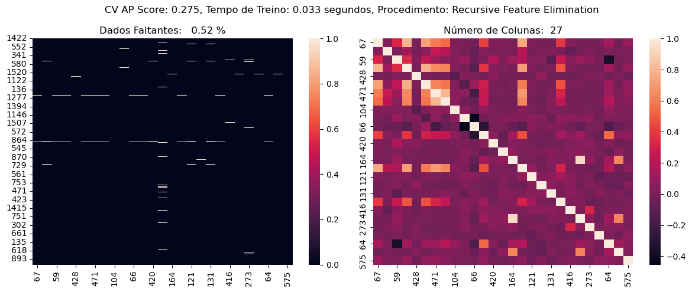
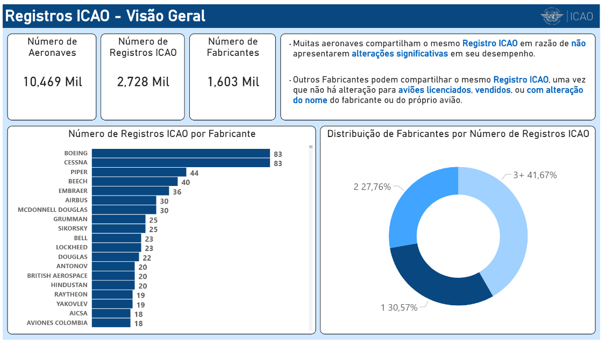
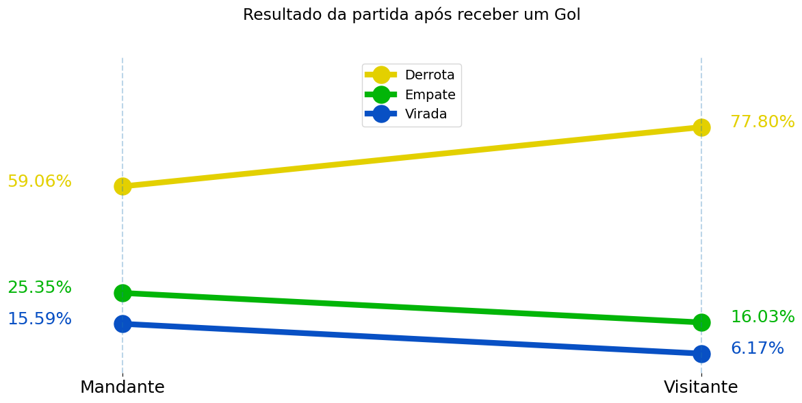

# Seja Bem Vindo ao meu Repositório!

## PROJETOS

### [Predição de Performance de Hélices de VANTs com XGBoost](https://github.com/hnrosa/uiuc-propeller) 

* Desenvolvimento de um modelo substituto e [aplicativo](https://surrogate-propeller.streamlit.app) para a predição da performance de hélices, facilitando a tomada de decisão no projeto motopropulsivo do VANTs.

* Os dados obtidos foram extraídos da [UIUC](https://m-selig.ae.illinois.edu/props/propDB.html).

* Tecnologias e Ferramentas Utilizadas:

        Extração e Limpeza de Dados: parse, os
        Feature Engineering: category-encoders, scipy
        Análise de Dados: matplotlib, seaborn, numpy, pandas
        Machine Learning: xgboost, scikit-learn, optuna, pendulum
        Deployment: streamlit

### [Detecção de Falhas de Semicondutores](https://github.com/hnrosa/uci-secom-fault-detection) 

* Classificação Binária da saúde de semicondutores, lidando com dados faltantes, dados desbalanceados e seleção de *features*.

* Conjunto de dados disponível em:  https://archive.ics.uci.edu/ml/datasets/SECOM

* Tecnologias e Ferramentas Utilizadas:

        Feature Selection e Engineering: feat-engine 
        Análise de Dados: matplotlib, seaborn, numpy, pandas
        Machine Learning: Regressão Logística, Imputação KNN, scikit-learn

### [Análise Exploratória das Aeronaves ICAO](https://github.com/hnrosa/icao-eda) 

* Análise Exploratória das Aeronaves Registradas ICAO, e extração de informações relevantes doo cenário aeronáutico atual.

* Dados disponíveis em: https://www.icao.int/publications/DOC8643/Pages/Search.aspx

* Tecnologias e Ferramentas Utilizadas:

        Raspagem de dados: Selenium
        Banco de Dados: MySQL
        Visualização e Análise de Dados: Pandas, PowerBI

### [Análise das Viradas do Brasileirão](https://github.com/hnrosa/brasileirao-viradas)

* Análise das Partidas de Viradas do Brasileirão no período de 2013 a 2021.

* Dados Disponíveis em:  https://www.kaggle.com/datasets/adaoduque/campeonato-brasileiro-de-futebol

* Tecnologias e Ferramentas Utilizadas:

        Análise de Dados: Matplotlib, Seaborn, Pandas

